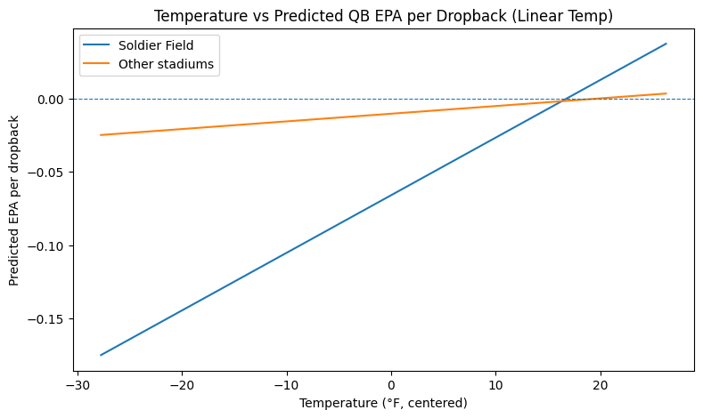
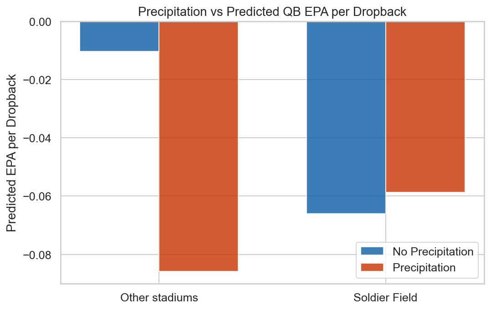
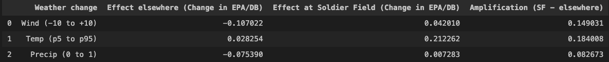
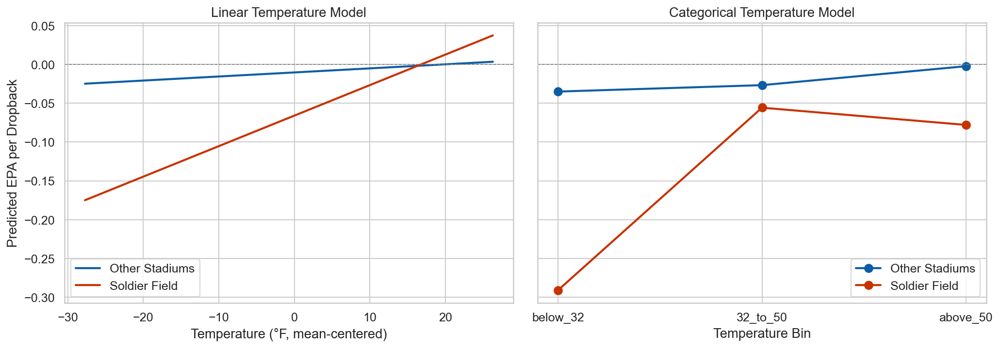

# Overview

Despite being one of the NFL’s oldest franchises, the Chicago Bears are the only team to never have a quarterback throw for 4,000 yards in a single season. Could there be an external, environmental related reason for this? Or (as might be suggested by fans of the rival Green Bay Packers) have the Bears just had a string of sub-par quarterbacks throughout their existence? 

The main focus of this project will be to study the effect of Soldier Field (where the Bears have played full-time since 1971) and weather on quarterback performance. I will focus on three main questions: 

1. Do temperature, wind, and precipitation impact quarterback performance? 
2. Is quarterback play at Soldier Field systematically different from other outdoor stadiums?
3. Does Soldier Field amplify the effects of poor weather conditions?

### Data

Quarterback performance is measured using EPA per dropback. EPA (Expected Points Added) is a play-by-play metric that estimates how much a given play increases or decreases a team’s expected points based on historical game situations. For example, a three-yard gain on 4th-and-2 is far more valuable than the same gain on 3rd-and-10, and EPA captures this contextual difference.

Defensive strength is also measured using season-level defensive EPA allowed per play. Because opponent quality strongly influences quarterback outcomes, defensive EPA allowed is included as a control variable in every model.

To improve interpretability, continuous predictors such as temperature, wind speed, and defensive EPA are mean-centered.

For more detailed information about the data itself, refer to the README file in the etl/ folder. 

### Modeling

To test these questions, I will use four models. The dependent variable in all models is quarterback EPA per dropback. Models are estimated sequentially to isolate the role of stadium identity and weather.

**Model 1** will act as the baseline model. It will compare how quarterback EPA per dropback is impacted by home field advantage and opponent's defensive EPA. When later models add in weather and Soldier Field factors, we can use this model as a point of reference. 

**Model 2** will add in a Soldier Field indicator. Now we can see if playing at Soldier Field impacts quarterback play (without looking for specific causes of that impact). 

**Model 3** will add in weather. Now I can compare how the temperature, wind, and precipitation are associated with quarterback play, and if Soldier Field still has an impact with these extra factors. 

**Model 4** will add in an interaction between Soldier Field and the weather factors. This will test if Soldier Field amplifies the impact of certain weather conditions on quarterback play. 

Models 3 and 4 will both have two versions. Version one will consider temperature to be a linear variable, while version 2 will consider temperature as a categorical variable to test whether temperature effects are linear. The difference in these variables is explained further in the etl/README file. 

All regression models in this project are estimated using ordinary least squares with HC3 heteroskedasticity-robust standard errors. Standard OLS inference assumes that the unexplained variability in quarterback performance is the same in every game, but this is unlikely to be true in an NFL setting, where outcomes can be much more volatile under certain conditions such as extreme weather, strong opponents, or unusual game situations. When this assumption is violated, coefficient estimates remain correct on average, but standard errors and p-values can be misleading. HC3 adjusts the calculation of standard errors so they remain reliable even when variability differs across observations, placing less weight on especially influential or unusual games. Importantly, this adjustment does not change the estimated effects themselves but rather only affects how much uncertainty is attributed to those estimates. Using HC3 therefore provides more trustworthy statistical inference while preserving the standard interpretation of regression coefficients.

### Results

Review of the model summaries shows a consistent pattern across specifications. Opponent defensive EPA allowed is statistically significant in every model, highlighting its importance as a control variable. When weather variables are added, wind speed and precipitation are also consistently significant, while the Soldier Field indicator is no longer precisely estimated. This pattern holds under both linear and categorical temperature specifications, suggesting that weather and opponent quality are the most reliably estimated factors affecting quarterback EPA per dropback.

Analysis was performed using a predict_epa function, which generates model-based predictions of EPA per dropback by varying one variable of interest while holding all other predictors fixed at their baseline values.

As shown in the below figure, wind substantially reduces quarterback efficiency across outdoor stadiums. However, this effect is muted at Soldier Field, where baseline passing efficiency is already lower. As a result, increasing wind does not disproportionately harm quarterback performance at Soldier Field relative to other stadiums.

Even though temperature does not show up as statistically significant in the regression results, the model’s predictions still show noticeable differences in quarterback EPA per dropback at different temperatures, especially at Soldier Field. This likely means that temperature effects are harder to measure precisely in noisy play-by-play data, but they may still matter in certain situations.

Finally, precipitation is associated with lower quarterback EPA per dropback at most outdoor stadiums. At Soldier Field, where baseline passing efficiency is already lower, the additional impact of precipitation is comparatively small, indicating no amplification of precipitation effects.

The table summarizes how changes in weather conditions affect predicted quarterback EPA per dropback, comparing games played at Soldier Field to games at other outdoor stadiums. Each row shows the change in predicted EPA per dropback when a weather variable worsens by a meaningful amount, holding all other factors constant.

Across all stadiums, worsening weather generally reduces quarterback efficiency. Increasing wind from low to high levels leads to a sizable drop in EPA per dropback at other stadiums, while precipitation also has a clearly negative effect. Warmer temperatures are associated with slightly improved quarterback performance elsewhere.

At Soldier Field, quarterback EPA per dropback is lower on average, but the additional impact of weather is smaller. Wind and precipitation have much weaker marginal effects at Soldier Field than at other stadiums, and temperature improvements are associated with a larger rebound in performance. As a result, the difference between Soldier Field and other stadiums narrows under poor weather conditions.

Overall, these results indicate that while weather negatively affects quarterback play in general, Soldier Field does not amplify these effects. Instead, quarterback performance at Soldier Field is consistently lower regardless of conditions, suggesting that factors other than weather are more likely to explain Chicago’s long-standing passing struggles.

Finally, I compared temperature as a linear variable vs as a categorical variable to see if that would lead to any differing results. As shown below, the two approaches lead to the same qualitative conclusions. In both cases, colder temperatures are associated with lower quarterback EPA per dropback, with especially poor performance at Soldier Field under cold conditions, and improved performance as temperatures rise.

The categorical model highlights non-linear patterns—most notably the sharp decline in quarterback performance at Soldier Field in freezing conditions—while the linear model smooths this behavior into a steeper overall temperature gradient. Importantly, neither specification changes the direction or interpretation of the results. Because the key findings are consistent across both approaches, the earlier conclusions regarding weather effects and Soldier Field interactions are robust to how temperature is modeled, and the preceding analysis remains valid.

