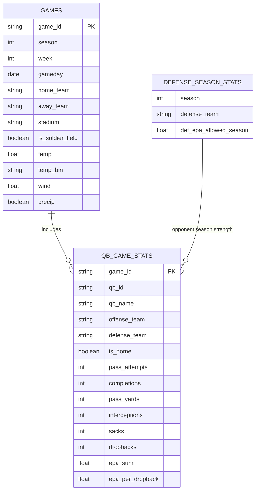

# ABOUT THE DATA

## Data Source
This project uses the nflverse library. This library provides R and Python packages and data related to the NFL going back to 1999. The nflreadpy package provides Python access to nflverse datasets.

nflverse: https://github.com/nflverse
nflreadpy: https://github.com/nflverse/nflreadpy

## ER Diagram

## Data Setup
This project uses three tables, shown above.

### Table 1: GAMES
The GAMES table contains information about each individual game. This information includes who played in the game, where and when the game was played, if the stadium was specifically Soldier Field, the weather, the wind, and precipitation levels. 

Temperature will be tested in two ways. The first way is to consider it a linear variable, where simply the degree value is considered. The second way is to consider it as a non-linear, categorical variable by using bins. These bins (below 32, 32-49, and 50+) consider that a 30 degree difference between 55 and 85 likely won't have a large impact on the game, but the difference between 10 and 40 degrees is considerable, for example. An initial four-bin specification split sub-zero temperatures into their own category, but with only 3 games below 0°F, this bin was too small for reliable estimation and was merged into the below-32 bin.

Precipitation is represented as a boolean indicator derived from game-level weather data. Games are marked as having precipitation if rain or snow related conditions were recorded at kickoff. This approach assumes that weather conditions do not change substantially over the course of a game. While imperfect, it provides a consistent proxy for inclement weather across seasons. 

This analysis excludes all games played in domes. This data is limited to only outdoor games where we have weather data available. 

### Table 2: QB_GAME_STATS
The QB_GAME_STATS table contains information about each quarterback performance per game. Because each game will have at least two quarterbacks playing, this data is stored separately from the generic game information. Each entry in this table will contain information about which game it was, who the quarterback was, who the game was between, if this quarterback was playing at home, and passing stats for that game. 

All of this data comes straight from the data source except for number of dropbacks and EPA per dropback. I compute dropbacks as the sum of pass attempts and sacks at the play-by-play level, summing per each quarterback per game. I then divide total EPA by this sum to create EPA per dropback. 

### Table 3: DEFENSE_SEASON_STATS
The DEFENSE_SEASON_STATS table contains season-level defensive EPA allowed per play for each team. For each quarterback–game observation, the opposing defense’s season-level EPA allowed is joined using the game season and defensive team, providing a control for opponent strength.

# Assumptions and Limitations
**Weather Measurement**: Weather conditions are measured at kickoff and assumed to be representative of conditions throughout the game. In reality, weather can change during play, especially for precipitation and wind. While this assumption introduces noise, it provides a consistent and scalable proxy for game-level weather across seasons.

**Season-Level Defensive Strength**: Defensive strength is measured using season-level defensive EPA allowed per play. This assumes that a defense’s quality is relatively stable within a season and does not account for injuries, roster changes, or game-specific matchups that may affect performance in individual games.

**Quarterback-Level Differences**: The models do not include quarterback fixed effects. As a result, differences in quarterback talent, experience, or play style are not explicitly controlled for and may contribute to residual variation in EPA per dropback. The analysis is therefore best interpreted as estimating average effects across quarterbacks rather than player-specific impacts.